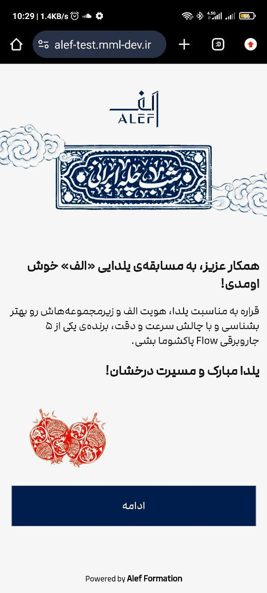
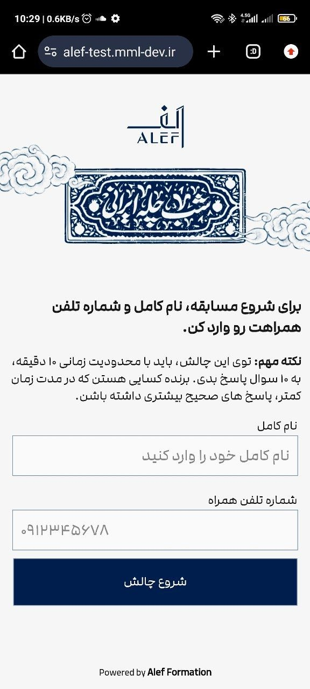

# Online Phone Web Game

## About
This is an online phone web game featuring a simple quiz format. It consists of:

- **10 Questions**
- **4 Answer Options per Question**
- **Scoreboard** to display user rankings and scores.

## Features
- **Questions**: The game contains 10 questions, each with 4 possible answers.
- **Scoreboard**: Displays the top players with their scores.
- **Admin Panel**: Allows for easy management of the game, including adding new questions and viewing player stats.

## Thanks
A special thanks to [**Wenodes**](https://wenodes.org) for letting me build and develop this project.

## Screenshots
 

## Links
- [Demo Link](https://alef-test.mml-dev.ir/)  
test with this 09123456789 
<!-- - [Admin Panel Link]() -->

